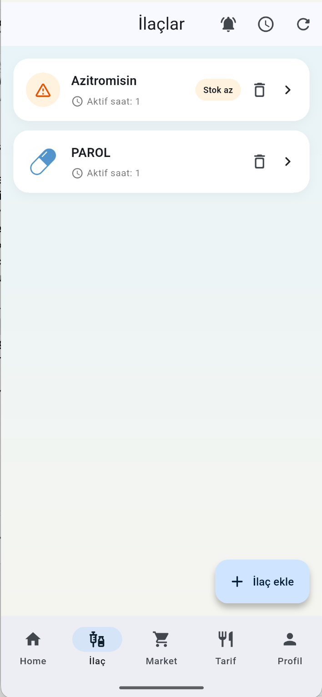
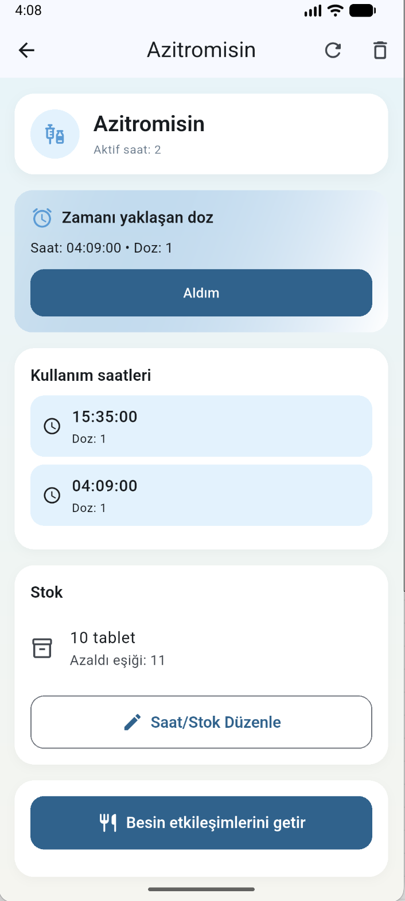
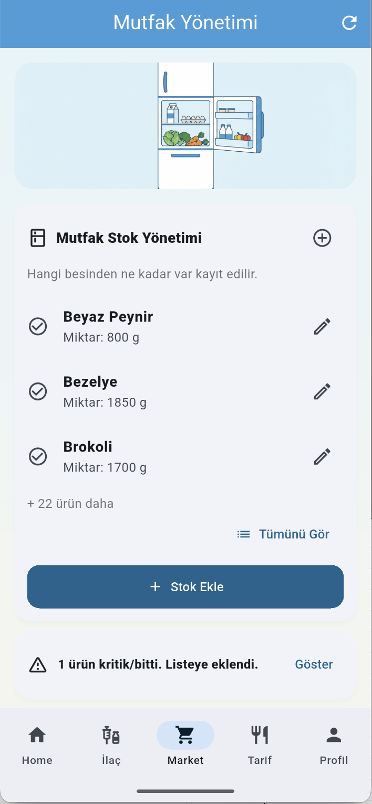
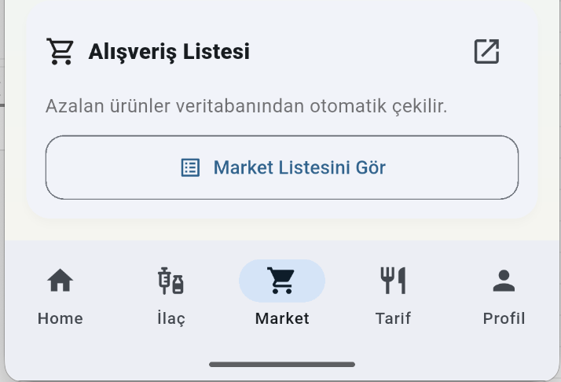
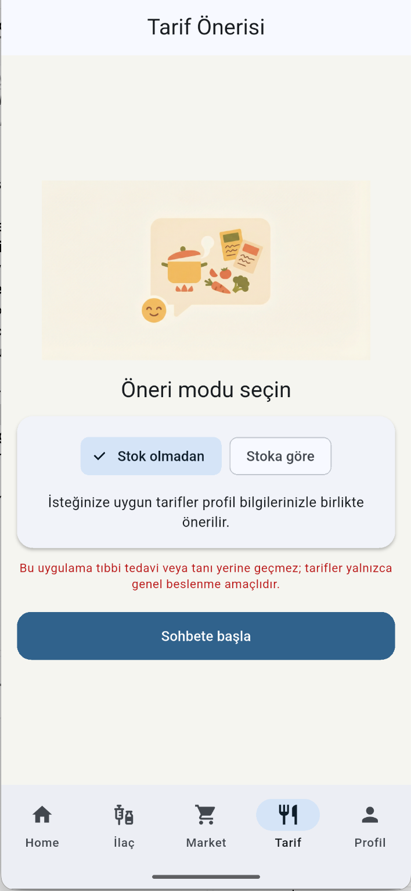
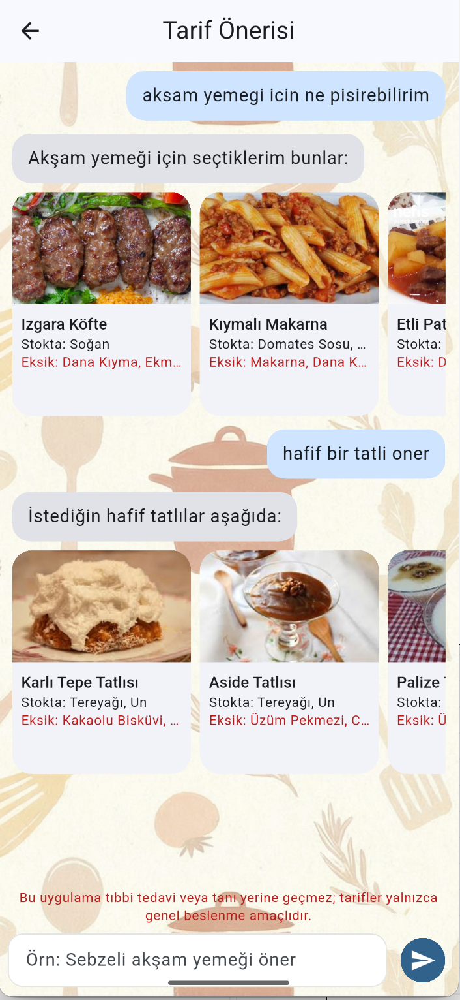
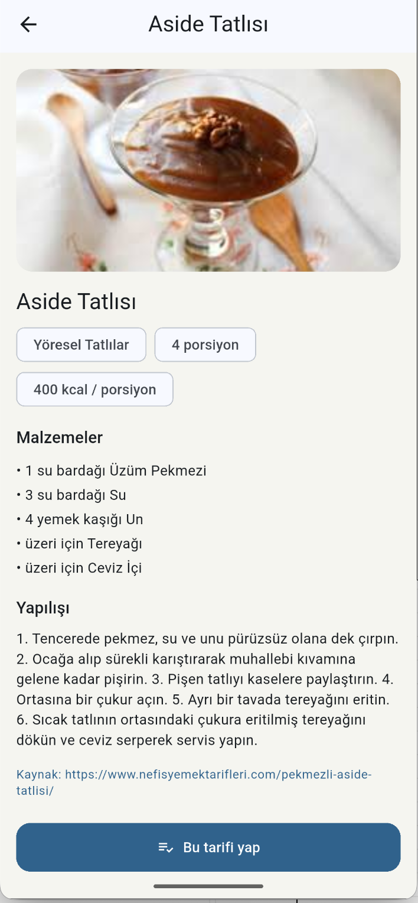
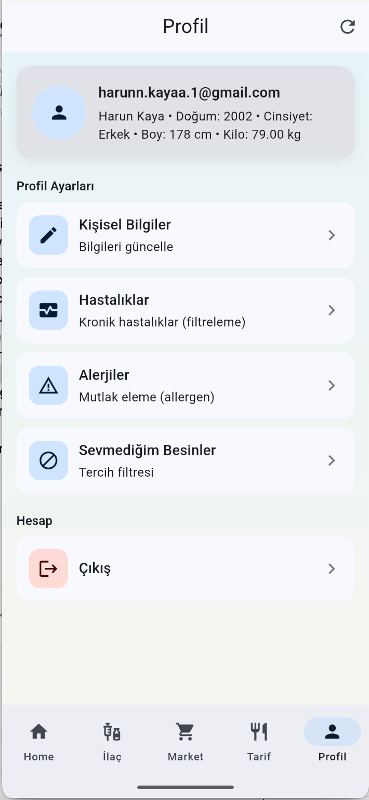

# Akıllı Tarif & İlaç — Mobil Uygulama

**Tarif önerisi, mutfak stoku, ilaç takibi ve kişisel sağlık bilgilerini tek uygulamada toplayan** Flutter mobil uygulaması. Günlük beslenme ve ilaç kullanımını takip eder; alerji, hastalık ve sevilmeyen besinlere göre kişiselleştirilmiş tarif önerileri sunar. Backend ile REST API üzerinden haberleşir; tarif önerileri RAG (Retrieval-Augmented Generation) ve LLM ile üretilir.


## Uygulama Hakkında

Uygulama beş ana sekmeden oluşur: **Ana Sayfa**,**Profil**, **İlaç**, **Mutfak** ve **Tarif**. Giriş sonrası ana sayfada günlük kalori özeti, mutfak ve ilaç stok sayıları, uyarılar ve son yapılan tarifler tek bakışta görülür. İlaç sekmesinde ilaç ekleyebilir, stok ve hatırlatma saatlerini yönetebilir, ilaç–gıda etkileşimlerini inceleyebilirsiniz. Mutfak sekmesinde kiler stoku (malzeme, miktar, birim, uyarı eşiği) ve alışveriş listesi yönetilir. Tarif sekmesinde önce **“Stok olmadan”** veya **“Stoka göre”** modu seçilir; sohbet arayüzünde yazdığınız isteğe göre backend tarif kartları döner; kartlara tıklayınca tarif detayı ve **“Bu tarifi yap”** ile pişirme (stok düşümü, günlük kalori ve son yemek kaydı) yapılır. Profil ekranında alerjiler, hastalıklar ve sevilmeyen besinler tanımlanır; tarif önerileri bu bilgilere göre filtrelenir.


## Özellikler (Ekran Görüntüleriyle)

### Ana sayfa — Özet

Tek ekranda: günlük tüketilen kalori (hedefe göre ilerleme çubuğu), mutfak stok ve ilaç sayıları, mutfak/ilaç stok uyarıları (azalan veya biten ürünler) ve son yapılan tarifler listesi. 


### Giriş ve kayıt

E-posta ve şifre ile giriş/kayıt. İlk girişte **“Önemli Bilgilendirme”** dialog’u gösterilir: uygulama teşhis veya tedavi amacı taşımaz; sağlık kararları için uzmana danışılması hatırlatılır. JWT token `flutter_secure_storage` ile güvenli saklanır; isteklerde Bearer token gönderilir.


### İlaç yönetimi

- **Liste:** Tüm ilaçlar listelenir; düşük stok uygun şekilde işaretlenir.
- **Ekleme / düzenleme:** İlaç adı backend’teki `GET /drugs/suggest` ile otomatik tamamlanır; doz, stok miktarı, hatırlatma saatleri girilir.
- **Detay:** İlaç–gıda etkileşimleri (`GET /drugs/{user_drug_id}/interactions`), **“İlacı aldım”** ile intake kaydı (`POST /intake`), hatırlatma bildirimleri ve erteleyip sonra tekrar bildirim alma (snooze) akışı.
- Bildirimler `flutter_local_notifications` ve `timezone` ile yerel olarak zamanlanır; bildirime tıklanınca uygulama İlaç sekmesine geçip ilgili ilaç detay sayfasını açar.




### Mutfak stoku ve alışveriş listesi

- **Kiler:** Malzeme adı tarif veri setinden gelen önerilerle girilir; miktar, birim (g/ml/adet) ve uyarı eşiği tanımlanır. Stok uyarıları ayrı endpoint ile alınır.
- **Alışveriş listesi:** Liste görüntülenir; manuel ekleme, tamamlandı işaretleme ve silme yapılır. Backend’te stoka göre listeyi yenileme (`/shopping-list/refresh`) desteklenir.




### Tarif önerisi

- **Mod seçimi:** **“Stok olmadan”** — isteğe ve profil bilgilerine göre serbest öneri; **“Stoka göre”** — kiler ve profil dikkate alınarak öncelikli öneri, eksik malzemeler vurgulanır.
- **Sohbet:** Kullanıcı mesajı `POST /recipes/chat/suggest` ile gönderilir; backend intent, RAG, stok/alerji kuralları ve LLM ile yanıt ve tarif kartları üretir. Kartlarda tarif adı, görsel, stokta olan / eksik malzemeler ve uyarılar yer alır.
- **Tarif detayı:** Tarif seçilince detay sayfası açılır. **“Bu tarifi yap”** ile `POST /recipes/{id}/cook` çağrılır; stok düşümü, günlük besin toplamları ve meal_log güncellenir. Stoka göre modda eksik malzemeler varsa önce kilere ekleme (miktar/eşik) dialog’u sunulur.





### Profil ve sağlık bilgileri

Alerjiler, hastalıklar ve sevilmeyen besinler ayrı listeler halinde yönetilir (`/profile/allergies`, `/profile/diseases`, `/profile/disliked-ingredients`). Tarif önerilerinde bu bilgiler backend tarafında kullanılarak uygun tarifler öne çıkarılır, uygun olmayanlar filtrelenir veya uyarı verilir.




## Teknik yapı

| Katman        | Teknoloji |
|---------------|-----------|
| Mobil         | Flutter (Dart 3.x), Material 3 |
| Ağ            | Dio (REST), JWT Bearer |
| Yerel saklama | shared_preferences, flutter_secure_storage |
| Bildirimler   | flutter_local_notifications, timezone |
| Backend       | FastAPI (Python), PostgreSQL, RAG (pgvector), OpenAI embedding + LLM |

### Mobil proje yapısı

```
lib/
├── core/                 # api_client, token_store, app_colors
├── features/
│   ├── auth/             # login_screen, register_screen, boot_screen, auth_api
│   ├── drugs/            # drugs_screen, drug_form_screen, drug_detail_screen, drugs_api, notification_service
│   ├── home/             # home_screen (özet: kalori, stok sayıları, uyarılar, son tarifler)
│   ├── kitchen/          # kitchen_home_screen, pantry_list_screen, shopping_list_screen, kitchen_api
│   ├── main/             # main_screen (alt navigasyon: Özet, İlaç, Mutfak, Tarif)
│   ├── profile/          # profile_screen, allergies/diseases/disliked_ingredients ekranları, profile_api, recipes_api, ingredients_api
│   └── recipes/          # recipe_mode_screen, recipe_chat_screen, recipe_detail_screen, recipes_api
└── main.dart
```

Renk paleti `lib/core/app_colors.dart` içinde merkezi tanımlıdır (arka plan gradyanı, primary, accent, uyarı renkleri vb.); tüm ekranlar bu paleti kullanır.

### Backend API özeti

- **Auth:** `POST /auth/register`, `POST /auth/login`
- **Kullanıcı:** `GET /users/me`
- **İlaç:** `GET/POST/PUT/DELETE /drugs`, `GET /drugs/suggest`, `GET /drugs/{id}/interactions`, `POST /intake`
- **Mutfak:** `GET/POST/DELETE /kitchen/pantry`, `GET /kitchen/pantry/alerts`, `GET/POST/PUT/DELETE /kitchen/shopping-list`, `POST /kitchen/shopping-list/refresh`
- **Tarif:** `POST /recipes/chat/suggest`, `GET /recipes/ingredients`, `GET /recipes/{id}`, `POST /recipes/{id}/cook`, `GET /recipes/daily-totals`, `GET /recipes/recent-meals`
- **Profil:** `GET/PUT /profile`, `GET/POST/DELETE /profile/allergies`, `/profile/diseases`, `/profile/disliked-ingredients`
- **Sağlık:** `GET /health/diseases` (hastalık listesi önerisi)

Tarif görselleri backend’te `app/static/recipes/{tarif_id}.jpg` olarak tutulur; API yanıtlarında `image_url` tam URL ile döner.


## Kurulum ve çalıştırma

### Gereksinimler

- Flutter SDK ^3.10.7
- Çalışan backend (FastAPI + PostgreSQL + gerekli ortam değişkenleri; tarif önerisi için LLM ayarları)

### Adımlar

1. Bağımlılıkları yükleyin:
   ```bash
   cd frontend/mobile_app
   flutter pub get
   ```

2. Backend adresini ayarlayın: Uygulama varsayılan olarak Android emülatör için `http://10.0.2.2:8000` kullanır. Adres `lib/core/api_client.dart` içinde değiştirilebilir.

3. Uygulamayı çalıştırın:
   ```bash
   flutter run
   ```

### Ekran görüntüleri

Ekran görüntüleri proje kökünde `screenshot/` klasöründedir. README’deki görseller bu klasöre göre göreli yollarla referans verilir.


## Lisans


